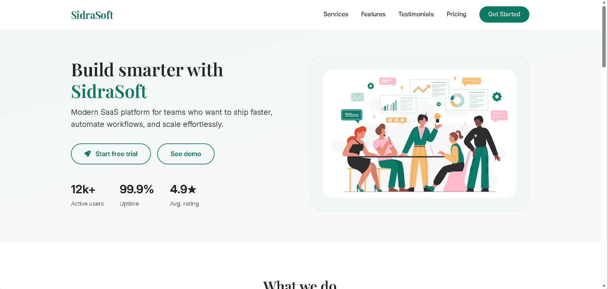
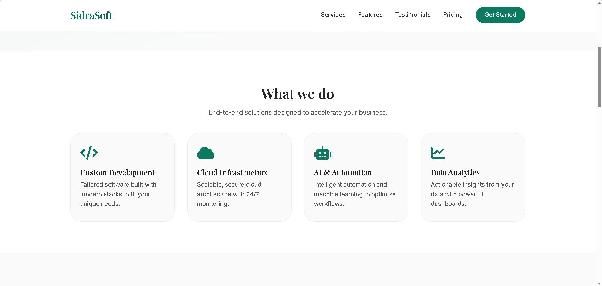
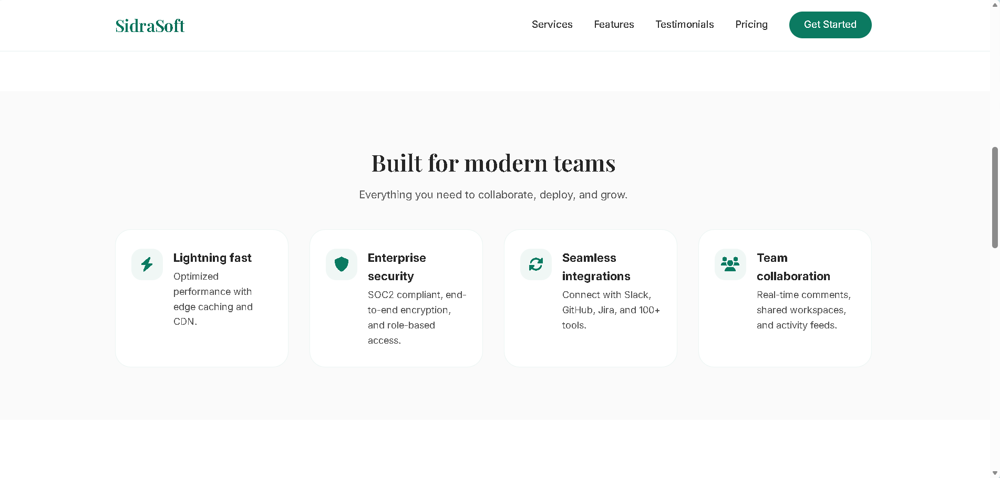
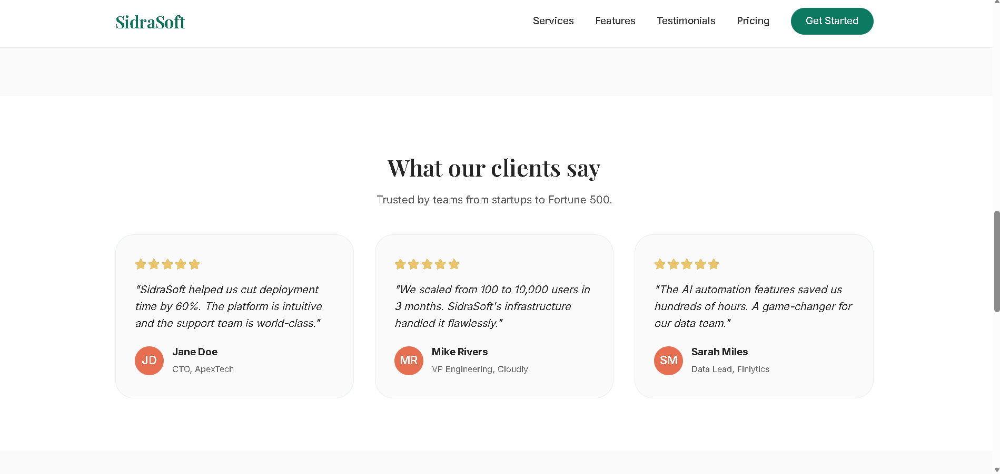
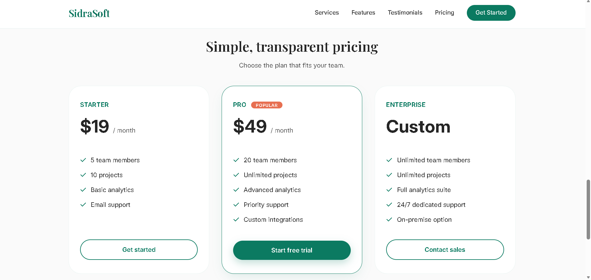
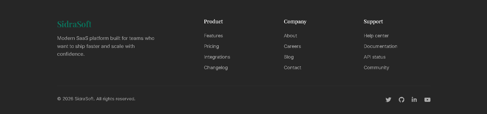

# SidraSoft – SaaS Landing Page

A modern and fully responsive SaaS Landing Page developed using HTML5 and CSS3. This project demonstrates professional frontend development practices, including responsive layouts, clean UI design, visual hierarchy, and the use of CSS Grid and Flexbox.

## 🚀 Features

* Responsive Hero Section
* Services Section
* Features Section
* Customer Testimonials
* Pricing Plans
* Professional Footer
* Mobile-First Design
* CSS Grid & Flexbox Layouts
* Modern Typography and UI Components

## 🛠️ Technologies Used

* HTML5
* CSS3
* Flexbox
* CSS Grid
* Font Awesome Icons
* Google Fonts

## 📸 Screenshots

### Hero Section



### Services Section



### Features Section



### Testimonials Section



### Pricing Section



### Full Landing Page View



## 📂 Footer

```text
SidraSoft-SaaS-Landing-Page/
│
├── index.html
├── style.css
├── sc/
│   ├── 1s.png
│   ├── 2s.png
│   ├── 3s.png
│   ├── 4s.png
│   ├── 5s.png
│   └── 6s.png
└── README.md
```

## 🎯 Learning Objectives

This project was built to practice:

* Responsive Web Design
* CSS Grid and Flexbox
* UI/UX Design Principles
* Mobile-First Development
* Website Layout Structuring
* Frontend Development Best Practices

## 👩‍💻 Author

**Sidra Liaqat**

Computer Science Student | Frontend Developer | Software Developer

## 📄 License

This project is created for educational and portfolio purposes.
